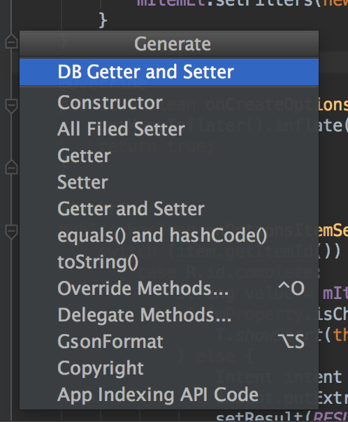
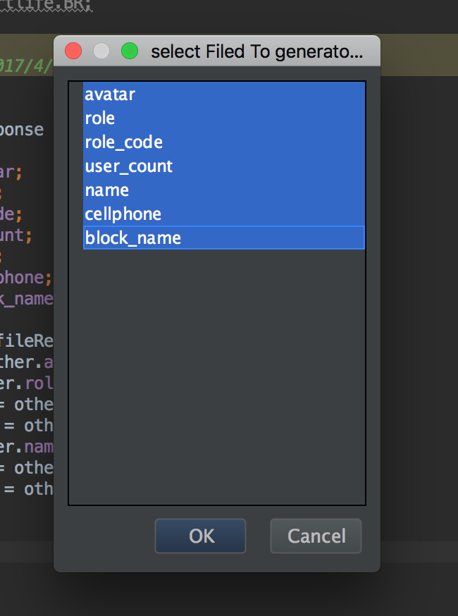
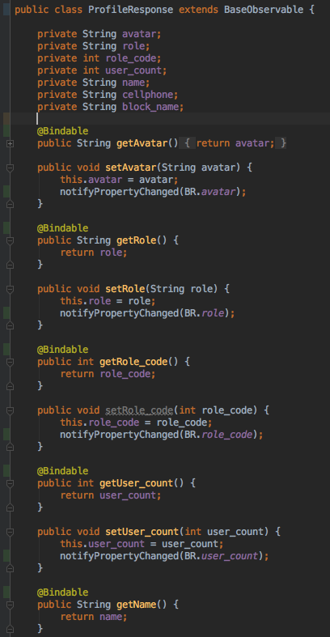

# DataBindingGetterSetter
[fork from DataBindingModelFormatter](https://github.com/Qixingchen/DataBindingModelFormatter), and do more. android data binding setter and getter, similar to the default getter/setter.

## screenshot

Before Format: 

show filed list 

Result 

